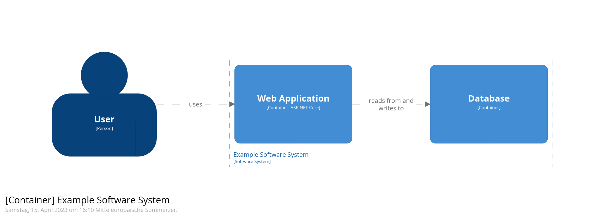

# structurizr-environment
Simple local setup for experimenting with the [Structurizr DSL](https://structurizr.com/dsl) and [Structurizr Lite](https://structurizr.com/help/lite) to create interactive [C4 models](https://c4model.com/).

## Getting started
Run `docker compose up` and navigate to `localhost:8080` to see the visualization in `Structurizr Lite`.  
You can create your C4 model in the `dsl`-folder. The `workspace.dsl` is the entry point and contains an example diagram.

## Example
  
## Useful VS Code extensions
- [C4 DSL Extension](https://marketplace.visualstudio.com/items?itemName=systemticks.c4-dsl-extension) (systemticks.c4-dsl-extension)
- [Structurizr](https://marketplace.visualstudio.com/items?itemName=ciarant.vscode-structurizr) (ciarant.vscode-structurizr)

## Relevant links
- [Structurizr DSL language reference](https://github.com/structurizr/dsl/blob/master/docs/language-reference.md)
- [The C4 model by Simon Brown](https://c4model.com/)
- [Structurizr DSL Online](https://structurizr.com/dsl)